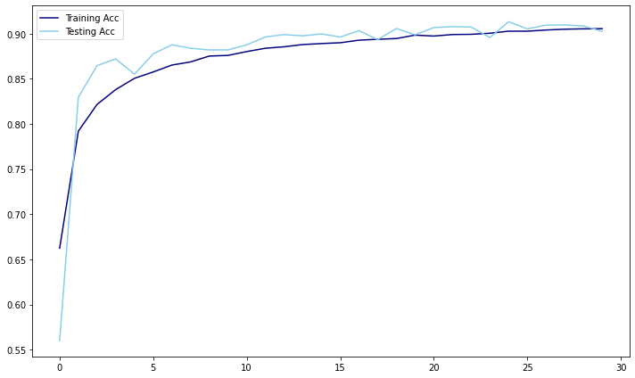
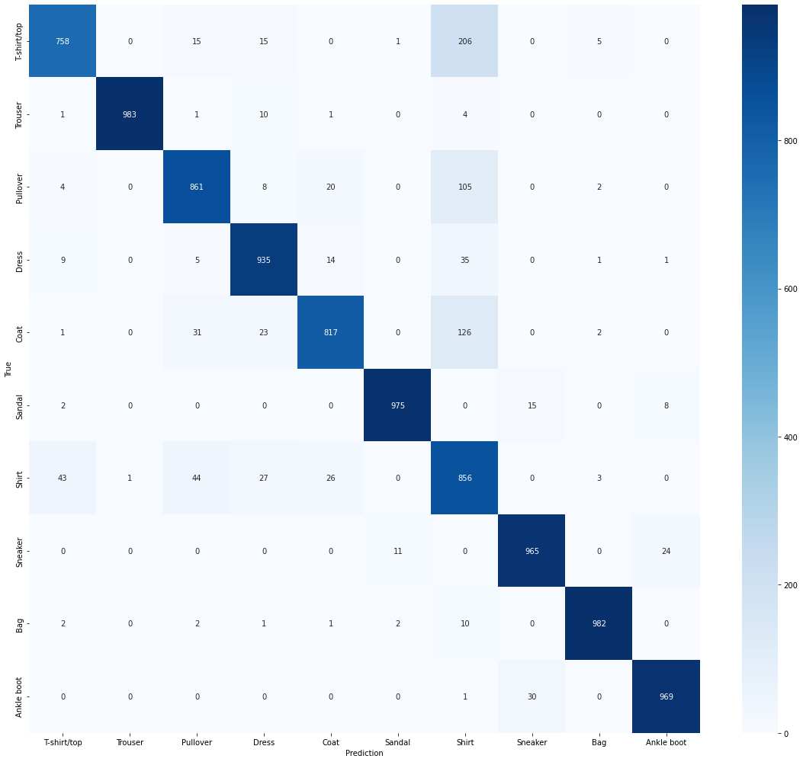
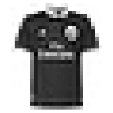
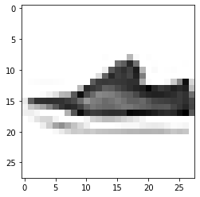

# **Neural Network Mini-Hackathon - Fashion MNIST Group Project**
---
## Problem Statement
---
Creating a [Neural Network](https://www.ibm.com/cloud/learn/neural-networks) model for the [Fashion MNIST dataset](https://www.kaggle.com/datasets/zalando-research/fashionmnist) on Kaggle. It is an image dataset with images of 28x28 pixels with 784 pixels total, and these pixels are broken into their respective columns. By utilizing [TensorFlow's Keras](https://www.tensorflow.org/api_docs/python/tf/keras) python module, we will create a classification model to identify between the 10 different labels for the image data. 

## Data Dictionary
---
|Feature|Type|Dataset|Description|
|---|---|---|---|
|label|int64|train|labels for image|
|pixel 1-784|int64|train|darkness of pixel|
|label|int64|train|0 = T-shirt/top| 
|label|int64|train|1 = Trouser|
|label|int64|train|2 = Pullover|
|label|int64|train|3 = Dress|
|label|int64|train|4 = Coat|
|label|int64|train|5 = Sandal|
|label|int64|train|6 = Shirt|
|label|int64|train|7 = Sneaker|
|label|int64|train|8 = Bag|
|label|int64|train|9 = Ankle boot|

## Analysis Summary
---
#### *Data Extraction*
The data was pulled from Kaggle using the Kaggle API for datasets - [zalando-research/fashionmnist](https://www.kaggle.com/datasets/zalando-research/fashionmnist?select=fashion-mnist_train.csv).

---

#### *Data Preprocessing & EDA*
The training dataset has 60000 rows and 785 columns. For each label(0-9), there are 6000 rows with that label, meaning the dataset is balanced. In the preprocessing, the pixels are scaled with the maximum value (255) and then reshaped using reshape(-1,28,28,1), this reshapes the image into 28x28 arrays. After that, the label column is manipulated into dummy columns.
##### Accuracy vs Val Accuracy

---
##### Confusion Matrix

---
##### Example of Image

---
##### One of Wrongly Predicted Image

---

#### *Modeling & Accuracy*
In the modeling of the neural network, we included a dropout of 25% in each layer and batch normalization in the first four layers. To compile the model, we used a loss function of binary cross-entropy, a rmsprop optimizer, and accuracy metrics.

---

## Conclusions and Recommendations
---
The model has an accuracy above 90%, which is a pretty good accuracy for predictive models. To create a better-performing model we could utilize more layers and more parameter tuning. However, this will require cloud computing and the usage of better GPUs. 